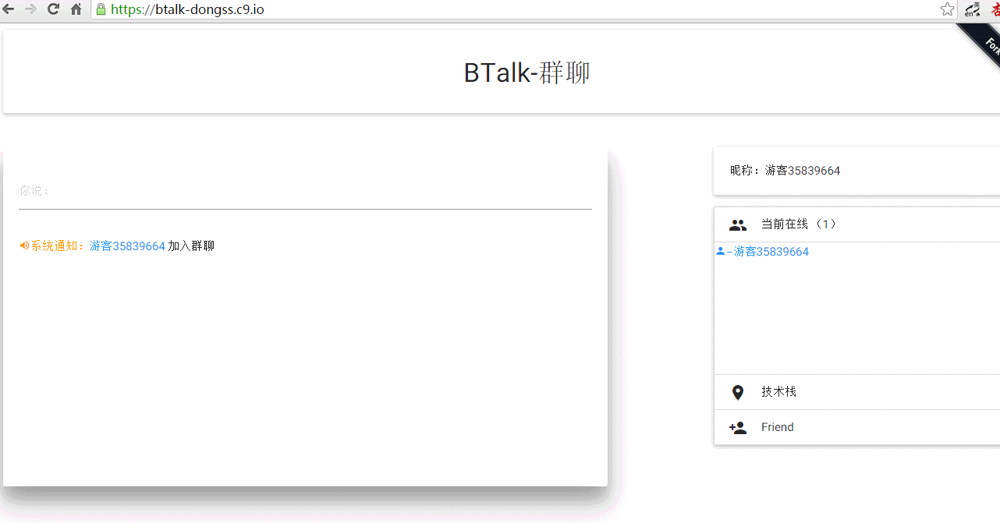

# BTalk 群聊

    Node.js v0.12.6
    Socket.io v1.3.5
    RequireJS v2.1.18
    Materialize v0.97.0

运行
```npm start```

运行需修改```public/javascripts/src/socket.js```
```
var socket = io.connect('http://localhost:3000');      // 改为 socket.io 实际监听地址
```

演示地址：https://btalk-dongss.c9.io/

